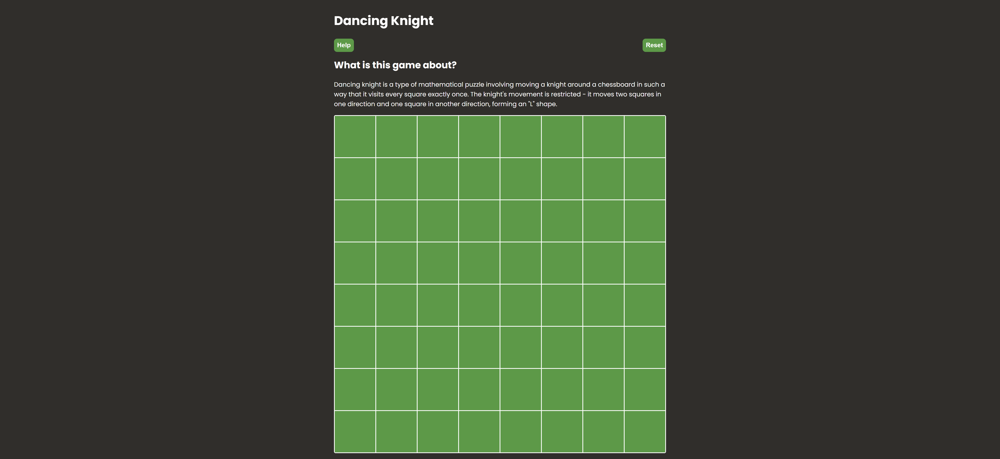

# Dancing Knight

Dancing knight is a type of mathematical puzzle involving moving a knight around a chessboard in such a way that it visits every square exactly once. The knight's movement is restricted - it moves two squares in one direction and one square in another direction, forming an 'L' shape.

## Demo

LIVE: [Dancing Knight](https://hrs-dancing-knight.netlify.app/)

## Screenshot

## Tech Stack

Yarn Vite React CSS

## Author

### Hubert Śleszyński

Portfolio: https://hrs-dev.netlify.app/

Linkedin: https://www.linkedin.com/in/hubertsleszynski/

Github: https://github.com/HubertSleszynski
